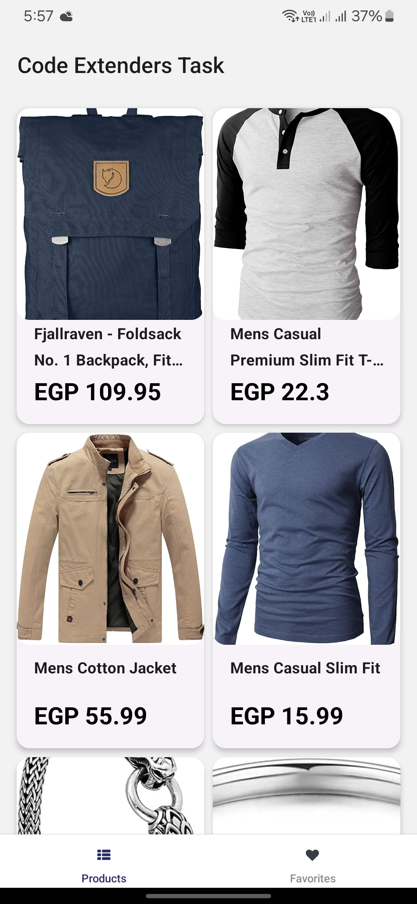
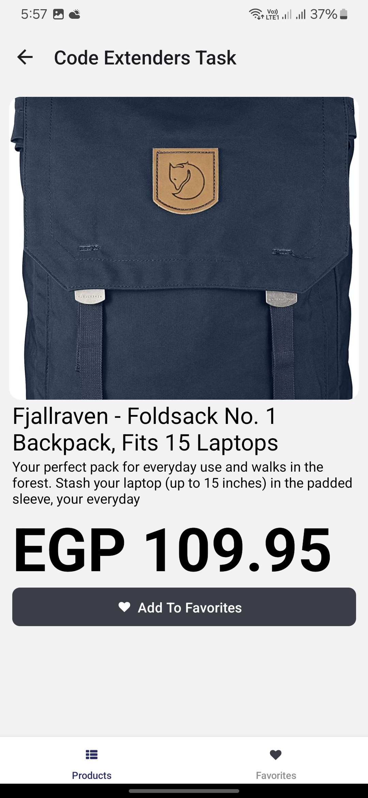
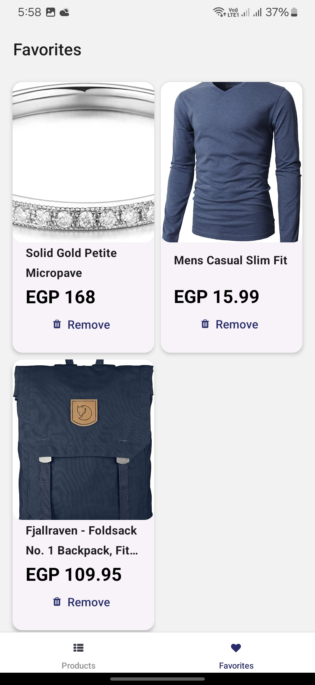

# CodeExtenders RN Task  

## Project Overview  

**CodeExtenders RN Task** is a React Native task submission for CodeExtenders. This application showcases essential functionalities such as fetching data, navigation, state management, and local data persistence. Users can browse products, view details, manage a favorites list, and persist favorite items using Async Storage.  
## Features  

- **Product Listing**: Displays a variety of products fetched from the Fake Store API.  
- **Product Details**: Navigate to a detailed view of any selected product.  
- **Favorites Management**:  
  - Add products to a favorites list.  
  - View the list of favorite products.  
  - Remove items from the favorites list.  
- **Data Persistence**: Favorite product IDs are stored in local async storage to retain data across app sessions.  
## Tech Stack  

- **React Native (EXPO)**: For building cross-platform mobile applications.  
- **Redux Toolkit**: For efficient state management.  
- **React Navigation**: For navigation between screens.  
- **React Native Paper**: For visually appealing UI components.  
- **Async Storage**: For local data persistence.  
- **TypeScript**: For type safety and better development experience.  
## Screenshots






## Repository  

- GitHub: [CodeExtenders RN Task](https://github.com/maghrabyy/codeextenders-react-native-task)  

## Installation

1. Clone the repository:  

 ```bash  
   git clone https://github.com/maghrabyy/codeextenders-react-native-task.git  
   ```
2. Navigate to the project directory:

```bash
cd codeextenders-react-native-task  
```

3. Install the dependencies:

```bash
npm install
```

4. Start the development server:
```bash
npm start
```
## Project Structure  

The project is organized as follows for clarity and scalability:  

- **root directory**  
  - **/assets**: Static files like images.  
  - **/components**: Reusable UI components.  
  - **/constants**: App-wide constants.  
  - **/hooks**: Custom hooks for reusable logic.  
  - **/navigation**: Navigation configuration and screens management.  
  - **/screens**: Screens for different views (e.g., Product List, Product Details, Favorites).  
  - **/store**: Redux Toolkit setup and slices.  
  - **/types**: TypeScript type definitions.  
## About Me


Hi! I’m **Mahmoud Elmaghraby**, a passionate frontend and mobile developer with expertise in React Native and Redux Toolkit. I enjoy creating intuitive and efficient applications. Feel free to connect with me or explore my other projects!  

- GitHub: [maghrabyy](https://github.com/maghrabyy)  
- LinkedIn: [Mahmoud Elmaghraby](https://www.linkedin.com/in/mahmoud-elmaghraby/)  
## License

This project is licensed under the [MIT](https://choosealicense.com/licenses/mit/) License.  

